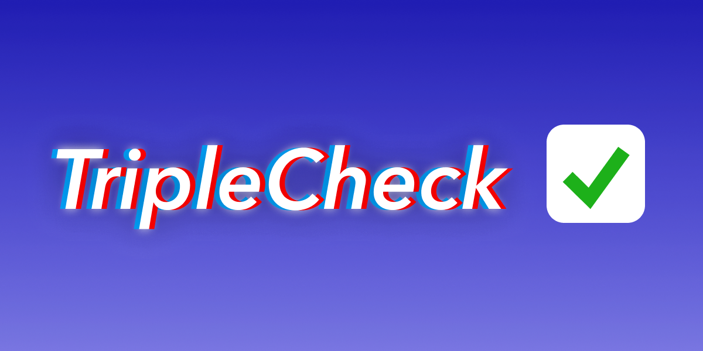
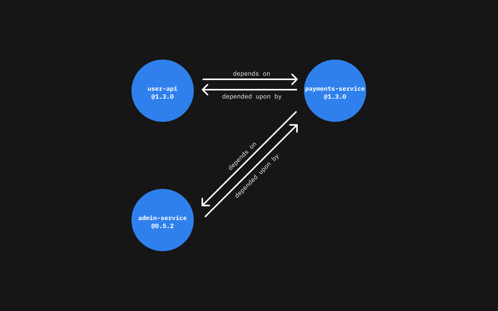
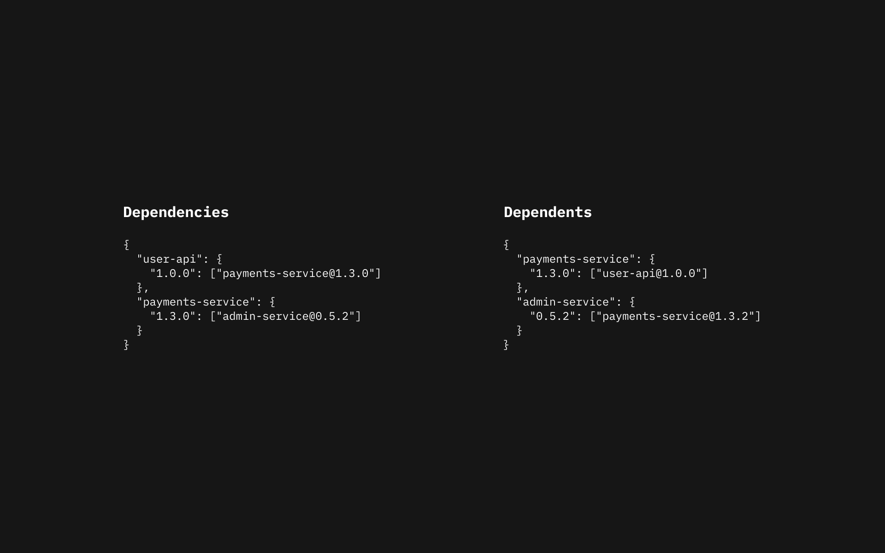

# triplecheck-cli




[](https://sonarcloud.io/dashboard?id=mikaelvesavuori_triplecheck-cli)

[](https://codescene.io/projects/15674)

[](https://codescene.io/projects/15674)

## TripleCheck CLI — The easiest and fastest way to do contract testing.

- [Design goals](#design-goals)
- [Installation](#installation)
- [Starting TripleCheck](#starting-triplecheck)
- [Configuration](#configuration)
- [Demo](#demo-testing-a-simple-contract)
- [The broker](#the-broker)
- [Working with TripleCheck](#working-with-triplecheck)
- [Development Flow](#development-flow)
- [Syncing schemas from AWS EventBridge and Google Cloud Platform Pub/Sub](#syncing-schemas-from-aws-eventbridge-and-google-cloud-platform-pubsub)
- [References](#references)

Contract testing should be as easy and painless as unit testing, yet it never really seems to be. TripleCheck tries to remove as much of the pain as possible. The end goal is to **always be able to ensure functionality of what others need of you** and **ensure functionality of what you need of others**.

In particular `triplecheck-cli` helps you with:

- Testing contracts (either plain objects or [JSON Schemas](https://json-schema.org));
- Publishing contracts and tests to a broker instance, [`triplecheck-broker`](https://github.com/mikaelvesavuori/triplecheck-broker);
- Sync schemas from AWS EventBridge and/or Google Pub/Sub and create contracts for them.

The three key features of the TripleCheck eco-system are:

1. **Simplified, smooth-as-melted-icecream two-way continuous testing**, meaning all parties by default do testing of both their dependencies and dependents;
2. Broker ("server") that you can publish contracts and tests to, and acts as an (optional) lightweight API to get a **global collection of all existing tests and contracts**;
3. A set of practically turnkey solutions that are ready-to-go for common modern toolchains/architectures.

## Design goals

- Ease over rich functionality, requires minimal effort to learn and operate
- Support any type of message or event as long as it can be represented as some kind of object (i.e. REST API, GraphQL, CloudEvents, proprietary message formats...)
- First-grade support for serverless compute (Lambda, Cloud Run...) and databases (Fauna, Dynamo, Firestore...)
- First-grade support for modern CI tools (GitHub Actions, cloud provider's toolchains..)
- Day 1 support for modern message brokers (Google Pub/Sub, AWS Eventbridge...)
- Remove the need for a _heavyweight_ broker
- Avoid mocking or making actual requests, instead compare static typed contracts
- Support any kind of infrastructure and data sources

Compared to [Pact](https://pact.io), TripleCheck cannot make deep semantic asserts (like testing an expected response body), it can only ensure type and schema consistency. [This is the true scope of contract testing](https://docs.microsoft.com/en-us/graph/overview). Tools like Pact are capable but, at least according to me, do too much. If you _really_ want to know more than whether the contracts and tests are compatible, Pact will remain a better fit for you than TripleCheck.

## Installation

### Global

Run `npm install triplecheck-cli -g` or `yarn global add triplecheck-cli`.

### Local

Run `npm install triplecheck-cli -D` or `yarn add triplecheck-cli -D`.

## Starting TripleCheck

Run `npx triplecheck-cli`.

## Configuration

### Initialize a configuration file

You can do this manually according to the example below—or make it real simple and just run one of the following commands.

**Global install**: Run `triplecheck init`.

**Local install**: Run `npx triplecheck-cli`.

### Basic configuration

This is the configuration that TripleCheck will generate for you (with the identity fields changed, of course ):

```json
{
  "identity": {
    "name": "GENERATED_FROM_PACKAGE_JSON_NAME",
    "version": "GENERATED_FROM_PACKAGE_JSON_VERSION"
  },
  "dependencies": [],
  "tests": {
    "include": [],
    "skipTestingLocalResources": false,
    "skipTestingRemoteResources": false,
    "skipIncludingDependents": false
  },
  "resources": {
    "local": {
      "contractsPath": "",
      "testsPath": ""
    },
    "remote": {
      "brokerEndpoint": ""
    }
  },
  "publishing": {
    "publishLocalContracts": true,
    "publishLocalTests": true
  }
}
```

### Recommendations for setup

#### Deploy a broker and point `brokerEndpoint` to it

Use one of the pre-baked brokers that correspond to your setup and deploy it. Point the config's `resources.remote.brokerEndpoint` to it.

#### Create a local contracts file and point `contractsPath` to it

Create a JSON file in your project folder. This should at least cover your own service. If you don't have any contracts for services you are dependent on in a broker yet, then ideally write those here as well. The format for a contract is:

```
[
  {
    "my-service": {
      "1.2.3": {
        "fieldName": "string",
        "canBeAnything": "string",
        "canBeAnyBasicType": false
      }
    }
  }
]
```

Specify the file and path in the config's `resources.local.contractsPath`.

#### Create a local tests file and point `testsPath` to it

Create a JSON file in your project folder. If you don't have any tests for services you are dependent on in a broker yet, then ideally write those here as well. The format is:

```
[
  {
    "my-service": {
      "1.2.3": [
        {
          "The name of your test": {
            "fieldName": "something",
            "canBeAnything": "djsh7-jk383fu-y33h",
            "canBeAnyBasicType": true
          }
        }
      ]
    }
  }
]
```

Specify the file and path in the config's `resources.local.testsPath`.

### Configuration details

Refer to the below type documentation for more details.

```ts
export type Config = {
  identity: Identity;
  dependencies: Dependency[];
  tests: Tests;
  resources: Resources;
  publishing: Publishing;
};

/**
 * Basic service identity data.
 */
export type Identity = {
  /**
   * Name of your service. If you generate a configuration with the "init" flag this will be picked up from
   * your package.json file, if you have one.
   * @example "my-service"
   */
  name: string;
  /**
   * Version of your service. If you generate a configuration with the `init` flag this will be picked up from
   * your package.json file, if you have one.
   * @example "1.0.0"
   */
  version: string;
};

/**
 * A dependency is how we list service we depend on. These will be also be added in addition to anything
 * listed in the `tests.include` block. This is a required array—think of this as the long-term way of
 * stating dependencies. When you publish, relations _will_ be inferred for/from any services listed here.
 * @example ["api-service@1.0.0", "some-other-service@2.1.5"]
 */
export type Dependency = string;

/**
 * Test setup.
 */
export type Tests = {
  /**
   * An array of strings that specify what services and versions we want to test. Note that these are _in addition_
   * to those listed in `dependencies`. This is an optional array—think of it as a temporary way of adding services
   * you want to test, for example in CI. When you publish, the relations will not be inferred from services present
   * here.
   * @example ["api-service@1.0.0", "some-other-service@2.1.5"]
   */
  include?: string[];
  /**
   * Should we skip testing tests found on a remote resource?
   */
  skipTestingRemoteResources?: boolean;
  /**
   * Should we skip testing tests found locally?
   */
  skipTestingLocalResources?: boolean;
  /**
   * Should we skip including dependent services from our remote broker?
   */
  skipIncludingDependents?: boolean;
  /**
   * An option to specify what the temporary generated contract file will be prefixed as.
   * The contract itself will be generated as a TypeScript (.ts) file.
   * You should remove any generated contracts in-between test runs to ensure you have
   * no conflicts with old data.
   * @example "__quicktype-contract"
   */
  contractFilePrefix?: string;
};

/**
 * Resources specify where we can find the things we need: local tests/contracts and a broker, for example.
 */
export type Resources = {
  local?: {
    /**
     * Where are you storing local contracts? These should be stored in an array of objects, all collected in a single file.
     * @example "./contracts/contracts.json"
     */
    contractsPath?: string;
    /**
     * Where are you storing local tests? These should be stored in an array of objects, all collected in a single file.
     * @example "./tests/tests.json"
     */
    testsPath?: string;
  };
  remote?: {
    /**
     * Where is the broker located?
     * @example "https://my-broker-service.com/api/"
     */
    brokerEndpoint?: string;
  };
};

/**
 * Publishing setup.
 */
type Publishing = {
  /**
   * Should we publish any contracts we store locally?
   */
  publishLocalContracts: boolean;
  /**
   * Should we publish any tests we store locally?
   */
  publishLocalTests: boolean;
};
```

## Demo: Testing a simple contract

TripleCheck CLI allows you to run tests by verifying [JSON Schemas](https://json-schema.org) and/or plain objects that represent contracts against test objects.

An example contract (plain object style) could be:

```json
[
  {
    "user-api": {
      "1.0.0": {
        "name": "Someone",
        "address": "Some Street 123",
        "age": 35
      }
    }
  }
]
```

In our list of contracts, we've provided `user-api` with version `1.0.0` and the three fields that it expects.
It doesn't matter who writes this contract, but it makes sense that the team/person writing the service handles this activity.

A basic test (again, a plain object) to verify schema integrity could look like:

```json
[
  {
    "user-api": {
      "1.0.0": [
        {
          "Verify identity": {
            "name": "Carmen",
            "address": "Ocean View 3000",
            "age": 27
          }
        }
      ]
    }
  }
]
```

To test the contract, we have constructed an array of tests for services and the versions of them that we want to test. An approach like this makes it easy to co-locate both contracts and tests in single respective files, or to assemble those files programmatically. If you use the [TripleCheck broker](https://github.com/mikaelvesavuori/triplecheck-broker) this is actually one of the things it helps you do, by piecing together contracts and tests. When testing, you can use a combination of local and/or remote tests and contracts. The configuration lets you set this as needed.

Notice that the exact semantics are not validated (i.e. `Carmen` vs `some other name`), but instead the shape. If you remove a field, or make the `age` field a string, the test would fail. Under the hood TripleCheck uses [Quicktype](https://quicktype.io) to do this checking. It's recommended to use [JSON Schema](https://json-schema.org) for more complex usecases. It also makes it easier to be concrete about actual types and what fields are required.

## The broker

### Do I need to have a broker?

No.

### Why would I want a broker?

The broker acts as a central, global resource so you can publish contracts and tests, meaning you create discoverability of what services exist, what their relations are, and because of that allows richer testing facilities. Most importantly this means you can—unless you change the default settings—dynamically test dependents' expectations on your service.

You also get the obvious benefit of storing contracts and tests somewhere that's not on your disk.

### When does it make sense to skip the broker?

If you only want to do basic one-way testing (maybe lightweight integration testing), or anything where you are not concerned of a distributed network of functions and APIs calling each other. But then maybe contract testing just isn't something you should be too concerned about anyway?

### What is the fastest way to get started with the broker?

There are several broker implementations that you can use right away or as the basis of your own starter kit. The current list is:

- [Google Cloud Run and Firestore](https://github.com/mikaelvesavuori/triplecheck-example-cloudrun)
- [Google Cloud Functions and Firestore](https://github.com/mikaelvesavuori/triplecheck-example-cloud-functions)
- [Cloudflare Workers and KV](https://github.com/mikaelvesavuori/triplecheck-example-cloudflare-workers)
- [AWS Lambda with DynamoDB](https://github.com/mikaelvesavuori/triplecheck-example-lambda)
- [Vercel with FaunaDB](https://github.com/mikaelvesavuori/triplecheck-example-vercel)
- [Netlify with FaunaDB](https://github.com/mikaelvesavuori/triplecheck-example-netlify)

Read more at the respective links or over at [triplecheck-broker](https://github.com/mikaelvesavuori/triplecheck-broker) for details on the broker.

## Working with TripleCheck

### Terminology

- **Test**: When you test compatibility between a contract and a test object (representing for example an API call).
- **Contract**: A document/file that shows the shape of your event/message/API in the form of an object or JSON Schema.
- **Publish a contract**: When you make a local contract public (adding/updating) into the shared data source (i.e. broker).
- **Relations**: There are two types of relations—_dependencies_ (what services a given service depends on) and _dependents_ (what services depend on a given service). Relations allow us to keep up-to-date on whether our work on a given service will break other services.

### How relations work

A visual representation:



And how they would look if you call the broker:



Certainly there can be services that have no dependencies or dependents, or any combination of those.

## Development flow

Contracts should be "owned" by the respective services. The individual service is primarily responsible for creating, updating and publishing their contract.

Tests can be written by anyone who has a dependency toward a given service.

### One contract per service

Each service should abide by one contract. This contract may have multiple versions.

### One local test file and one local contracts file

Note: This recommendation stands, unless you only use remote data.

All tests are collected in a single file. Same goes for the contracts. These can, respectively, contain any number of services and versions.

### Use the remote collections of tests and contracts

Make sure to publish collections to the remote data storage. Only keep locally the minimum number of things you need. For a typical provider it would be your own service (provider) contract and your tests.

Use `tests.include` in the configuration to decide what you actually need to test.

### Dependent services will be tested by default

If a service X is dependent on you, those tests will be run automatically as well.

This can be skipped by setting `tests.skipIncludingDependents` to `true`.

### How do I update or "unpublish" tests and/or contracts?

Any updates will replace the pre-existing data (being "idempotent").

Deleting tests/contracts is currently something you have to do manually by calling the broker API.

### What about schemas for GraphQL services and APIs?

There's a few aspects to this. With GraphQL you do get pretty good validation and typing on the service level but not necessarily on the actual managed API.

At least I am inclined to think that if you are running a managed API (such as AWS/GCP API Gateway) you will want to have schema validation on it. If you already have that, and are running GraphQL, then that schema should be ready (or nearly ready) to use as a contract with TripleCheck—OpenAPI schemas are after all very similar to JSON Schema. This has worked fine for me with AWS API Gateway, for example.

If you want to convert a GraphQL schema you can use a package like [graphql-2-json-schema](https://www.npmjs.com/package/graphql-2-json-schema). You may also want to take a look at my own API-oriented solution [convert-gql-to-json](https://github.com/mikaelvesavuori/convert-gql-to-json) that uses that same package. Frankly I've had mixed success, but feel free to try it and do a pull request if you can improve it (either the original base package or my API variant of it).

## Syncing schemas from AWS EventBridge and Google Cloud Platform Pub/Sub

Add these these to your `package.json` scripts block:

```json
"sync:aws": "sh ./node_modules/triplecheck-cli/generate-schemas-from-aws.sh your-registry-name",
"sync:gcp": "sh ./node_modules/triplecheck-cli/generate-schemas-from-gcp.sh",
"merge-schemas": "sh ./node_modules/triplecheck-cli/merge-schemas.sh existing-contracts-file.json generated-contracts-folder"
```

Don't forget to change `your-registry-name` if you want to use the AWS option.

The `merge-schemas` command also requires your own values, so change that too if you are going to use it.

Note that the shell scripts are entirely separate from TripleCheck, and therefore won't take any options from your configuration file. Feel free to copy and modify these shell scripts if you want to extend them with more functionality.

### AWS EventBridge example

Save the below content in an EventBridge schema named `demo-schema`:

```json
{
  "$schema": "http://json-schema.org/draft-04/schema#",
  "definitions": {
    "address": {
      "type": "object",
      "properties": {
        "street_address": {
          "type": "string"
        },
        "city": {
          "type": "string"
        },
        "state": {
          "type": "string"
        }
      },
      "required": ["street_address", "city", "state"]
    }
  },
  "type": "object",
  "properties": {
    "billing_address": {
      "$ref": "#/definitions/address"
    },
    "shipping_address": {
      "$ref": "#/definitions/address"
    }
  }
}
```

The above when run with the AWS sync script will generate the following file `generated-schemas-aws/demo-schema@1.0.0.contract.json`:

```json
[
  {
    "demo-schema": {
      "1.0.0": {
        "$schema": "http://json-schema.org/draft-04/schema#",
        "definitions": {
          "address": {
            "type": "object",
            "properties": {
              "street_address": {
                "type": "string"
              },
              "city": {
                "type": "string"
              },
              "state": {
                "type": "string"
              }
            },
            "required": ["street_address", "city", "state"]
          }
        },
        "type": "object",
        "properties": {
          "billing_address": {
            "$ref": "#/definitions/address"
          },
          "shipping_address": {
            "$ref": "#/definitions/address"
          }
        }
      }
    }
  }
]
```

### GCP Pub/Sub example

Save the below content in a schema named `sensor-data`:

```json
{
  "type": "record",
  "name": "Avro",
  "fields": [
    {
      "name": "Temperature",
      "type": "string"
    },
    {
      "name": "Timestamp",
      "type": "string"
    }
  ]
}
```

The above when run with the GCP sync script will generate the following file `generated-schemas-gcp/sensor-data@1.0.0.contract.json`:

```json
[
  {
    "sensor-data": {
      "1.0.0": {
        "required": ["Temperature", "Timestamp"],
        "properties": {
          "Temperature": {
            "type": "string"
          },
          "Timestamp": {
            "type": "string"
          }
        }
      }
    }
  }
]
```

### Merge scripts example

After generating a contract from your cloud provider's schema service, it's time to put it into your local contracts file.

Given that you ran an AWS sync, that your schemas folder is `generated-schemas-aws`, and that your contracts are located at `contracts.json`, then running the full merge command would look like:

```
sh ./node_modules/triplecheck-cli/merge-schemas.sh contracts.json generated-schemas-aws
```

The generated output would simply be a merged JSON file. Now, if you were to run tests, then those contracts would start to be used (pending correct configuration and a set of tests for the services).

## References

- [Article detailing roughly how TripleCheck implements Quicktype](https://blog.dennisokeeffe.com/blog/2020-09-20-generating-types-with-quicktype/)
- [JSON Schema: Structuring a complex schema](https://json-schema.org/understanding-json-schema/structuring.html)
